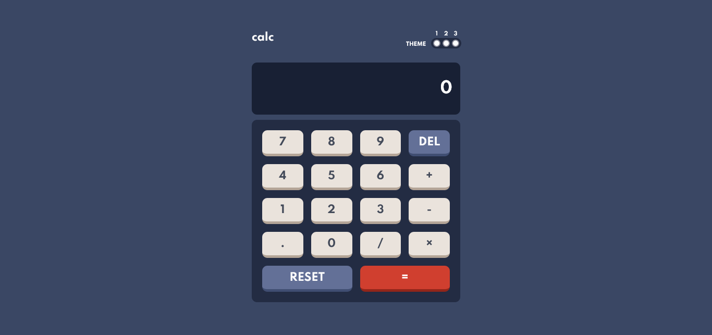
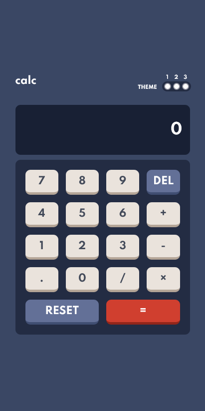

# Frontend Mentor - Calculator app

## Welcome! 👋

Thanks for checking out this front-end coding challenge.

[Frontend Mentor](https://www.frontendmentor.io) challenges help you improve your coding skills by building realistic projects.

**To do this challenge, you need a good understanding of HTML, CSS and JavaScript.**

- [Overview](#overview)
  - [The challenge](#the-challenge)
  - [Solution Screenshot](#screenshot)
  - [Links](#links)
- [My process](#my-process)
  - [Built with](#built-with)
  - [Useful resources](#useful-resources)
- [Author](#author)

### The challenge

Your challenge is to build out this calculator app and get it looking as close to the design as possible.

You can use any tools you like to help you complete the challenge. So if you've got something you'd like to practice, feel free to give it a go.

Your users should be able to:

- See the size of the elements adjust based on their device's screen size
- Perform mathematical operations like addition, subtraction, multiplication, and division
- Adjust the color theme based on their preference
- **Bonus**: Have their initial theme preference checked using `prefers-color-scheme` and have any additional changes saved in the browser

### Screenshot

## Desktop

## Mobile

### Links

- Solution URL: [Calculator Solution](https://www.frontendmentor.io/challenges/calculator-app-9lteq5N29/hub/html-css-flexbox-grid-javascript-y4wnZwc8c)
- Live Site URL: [Live Site](https://calc-app-site.netlify.app/)

## My process

### Built with

- Semantic HTML5 markup
- Sass (Syntactically awesome stylesheets)
- CSS custom properties
- Flexbox
- CSS Grid
- Mobile-first workflow

### Useful resources

-[CSS Grid Detail](https://css-tricks.com/snippets/css/complete-guide-grid/).
Please checkout the link to understand `Grid` better in full depth, very nicely elucidated by
Chris House.

-[CSS Flexbox Detail](https://css-tricks.com/snippets/css/a-guide-to-flexbox/).
Please checkout the link to understand `Flexbox` better in full depth, very nicely elucidated by
Chris Coyier.

## Author

- Frontend Mentor - [@Pritam-Tirpude](https://www.frontendmentor.io/profile/Pritam-Tirpude)
- Twitter - [@ptirpude1991](https://twitter.com/ptirpude1991)
